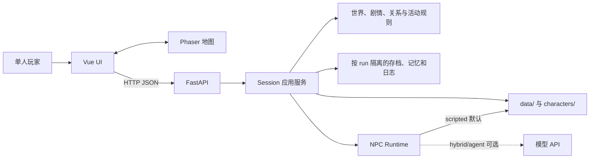

# UW 统一玩法与内容设计总纲

- **统一版本**：`0.6.0`
- **产品状态**：内部纵向切片，可开发、可试玩；玩法优化方向已确定，待分阶段实施
- **最后整理**：2026-08-08
- **融合来源**：`WORLD-MACRO-001 v002`、`WORLD-MICRO-001 v002`、`NAR-PRECAP-001 v002`、`NAR-ADAPT-001 v002`、`CHAR-DEPTH-001 v002`、`NAR-VOICE-001 v001`、`NAR-BARK-001 v001`、`NAR-LORE-001 v001`，以及 2026-08-08 玩法诊断结论
- **参考游戏**：星露谷物语、摩尔庄园、奥比岛、梦幻西游、传奇、夏日狂想曲

> 本文件是 UW 玩法与内容设计的唯一事实源。旧版 v001/v002 写作文档的内容已合并至此；需要追溯时使用 Git 历史，不再在工作树中并列多版本。后续新增内容直接修改本文件，不创建 v003/v004 副本。

---

## 第一部分：项目定义与边界

### 1.1 项目定义

UW 是一个单人 2D 叙事 RPG。玩家以桐人的视角，在卢利特村与尤吉欧、爱丽丝共同生活、劳动、调查并做出选择。选择可以改变关系、记忆、准备方式、对话和告别反馈，但不改写"爱丽丝最终被带走"的固定终点。

**核心设计理念（0.6.0 更新）**：

叙事骨架已经扎实，但**玩法层必须让玩家"想再多玩一天"**。因此 0.6.0 的设计目标从"只完成序章纵切片"扩展为"在序章框架内填充足够丰富的日常玩法，使 15-25 分钟的主线体验之外，仍有可重复的乐趣"。

参考方向：
- **星露谷物语**：日常劳动本身有乐趣和产出，时间管理是策略
- **摩尔庄园/奥比岛**：生活感、收集感、家园归属感，轻量但上瘾的日常循环
- **梦幻西游**：成长和经济循环，关系系统可见可感
- **夏日狂想曲**：关系管理的可见反馈，时间分配的紧迫感
- **传奇**：简单直接的成长多巴胺

### 1.2 玩家承诺

玩家进入游戏后应当迅速理解：

- **我是谁**：桐人，卢利特村的见习记录员（村民岗位）
- **我在哪里**：卢利特村
- **我和谁在一起**：尤吉欧、爱丽丝、赛尔卡
- **我现在要做什么**：前往巨神树并与两人会合
- **我每天还能做什么**：砍树、读书、采药、钓鱼、巡查、帮村民做事
- **我的选择有什么意义**：影响关系、记忆、准备和后续回应
- **我的劳动有什么意义**：产出材料、提升熟练度、解锁新活动
- **故事会走向哪里**：越界、返村、宣罪、告别，最终爱丽丝被带走

新玩家应在 60 秒内完成第一次有效互动，不需要阅读开发说明或理解内部系统名。

### 1.3 不可破坏的边界

- FastAPI 是位置、时间、资源、flag、关系、剧情闸和永久记忆的权威
- scripted NPC 是无模型 API 时的完整产品基线；hybrid/agent 必须可回退
- 被拒绝的行动不得部分写入状态
- 未审核素材不得进入 runtime
- `runs/`、`data/memory/`、`frontend/dist/`、密钥和本地环境不得提交
- 架构所有权变化先写 ADR；产品范围变化先修改本文件

### 1.4 当前范围

#### 必须完成（P0）

- N01-N10 连续主线与唯一终点
- 桐人、尤吉欧、爱丽丝三人的关系与记忆回响
- 卢利特村、巨神树、尽头山脉和村中抓捕所需的最小场景表达
- 移动、附近互动、对话、选择、结果、菜单、存档和恢复
- 桌面键鼠与移动触控均可通关
- 后端权威状态、原子行动、存档兼容、日志和回放
- **关系系统可视化（0.6.0 新增 P0）**
- **至少 3 种可重复生活活动有独立操作手感（0.6.0 新增 P0）**

#### 应在发布前完成（P1）

- **物品栏与消耗品系统**
- **小游戏深度提升（连击/道具组合/多段判定）**
- **记忆图鉴/成就面板**
- **至少 2 个地图区域增加可交互内容**
- Phaser chunk 分包
- 焦点态、非颜色提示、字体和触控目标复查
- 存档 schema 长期迁移说明

#### 当前不做（P2/P3）

- 爱丽丝被带走后的章节
- 完整战斗系统、全角色动作包、全配音、3D、联网多人
- 角色成长系统（等级/技能树）--P2 评估
- 经济系统（货币/商店）--P2 评估
- New Game+ / 多周目继承 --P3

---

## 第二部分：世界观与设定（融合 WORLD-MACRO-001 v002）

### 2.1 三栏分类体系

所有设定按三类标注：

| 分类 | 含义 | 约束 |
|---|---|---|
| **A** | 官方明确 | 不可改写 |
| **B** | 原作·动画明确但当前官方网页摘要未覆盖 | 不可改写，但具体表现方式可由项目在不剧透前提下原创 |
| **C** | 项目原创补充 | 不得替代 A/B；可改但不进关键节点表 |

### 2.2 顶层结构

```
人界（Human Empire）
├── 中央大教堂（Central Cathedral）── Pre-Capture 阶段不可进入、不可详细描写
│   ├── 最高司祭（Administrator）── 不可见
│   ├── 元老院 ── 不可见
│   └── 整合骑士团 ── 仅 N08/N09/N10 在村中出现
├── 禁忌目录（Taboo Index）── 世界规则，非普通法律
├── 卢利特村（Rulid Village）── 玩家在此出生成长
│   ├── 村务长（加斯夫特代行 / Alice 父亲）
│   ├── 北门巡守（加利塔）
│   ├── 神圣术见习（爱丽丝 / 赛尔卡）
│   ├── 巨神树伐木手（桐人 / 尤吉欧）
│   └── 见习记录员（桐人的村民岗位）
├── 尽头山脉（End Mountains）
│   ├── 洞窟 ── N05/N06 舞台
│   └── 边界线 ── 爱丽丝越界处
└── 暗黑界（Dark Territory）── 远方存在，不可进入
```

### 2.3 权力与法律

- **最高司祭**：Axiom Church 最高司祭。Pre-Capture 阶段不出现姓名、长相、政治动作 `[A]`
- **整合骑士**：仅 N08（来到村中宣告）、N09（在告别现场）、N10（在北门外带走）在村中出现 `[B+C]`。N10 之前不出现 Synthesis 编号、神器名字
- **禁忌目录**：世界规则。玩家可见条目极少（"北门不越过"等可观察条目）`[A]`。村民对它敬畏但不完全理解
- **神圣术**：治疗、读/写记录、做标记、存物、简短记号。桐人不会学到战斗级术式；可学"读记录"与"做标记"两档基础 `[C]`

### 2.4 资源体系

| 资源 | 分类 | 描述 | 玩法用途（0.6.0 扩展） |
|---|---|---|---|
| 食物 | C | 干粮/汤/馅饼 | 可持有、可使用恢复体力；烹饪产出 |
| 木材 | A | 巨神树 | 砍树产出，可用于制作/修缮 |
| 神圣力 | C | Alice/Selka/书库 | 神圣术消耗；可恢复 |
| 天命 | A | HP/MP | 战斗/巡查消耗；夜间恢复 |
| 体力 | C | 日常活动消耗 | 所有活动消耗；食物可恢复 |
| 草药 | C（0.6.0 新增） | 西侧田野采集 | 制作恢复道具 |
| 鱼类 | C（0.6.0 新增） | 南湖旧渡垂钓 | 食材/收藏 |
| 刻印素材 | C（0.6.0 新增） | 书库/巡查获得 | 手抄祈句卷轴 |
| 村务贡献点 | C（0.6.0 新增，P2） | 完成巡查/帮村民 | 兑换道具/情报 |

> **不可写**：任何具体的"金币/通货"暴露给玩家；任何"等级/经验值"暴露。贡献点只在 P2 阶段评估引入。

### 2.5 信息传播渠道

| 渠道 | 分类 | 描述 | 玩法用途 |
|---|---|---|---|
| 教会书库 | A+C | 旧记录/神圣术教材/禁忌目录节选 | 读书玩法；线索发现 |
| 村务会议 | A+C | 村务长召集；公布禁忌目录变更 | 听传闻活动；公告柱 |
| 北门值班记录 | A+C | 加利塔每日填写 | 巡查前置；线索交叉验证 |
| 村道传闻 | C | 村民口耳相传 | 听传闻活动；氛围营造 |
| 三人内部记录 | C | 桐人记录本+Alice 判断 | N10 最后一份记录 |

### 2.6 剧透护栏

以下内容在 N10 之前**任何人不得说出、不得暗示**：

1. 爱丽丝未来的整合骑士身份、金木樨之剑、中央大圣堂内部政治
2. 尤吉欧的青蔷薇之剑（只能作为北方洞窟的传说轻轻带过）
3. 桐人的现实世界记忆（SAO 相关），只能表现为说不清来源的既视感
4. 元老院的具体人名、席位、内部流程
5. 整合骑士的 Synthesis 编号（N10 之后可回看）

---

## 第三部分：地点设定（融合 WORLD-MICRO-001 v002 + 玩法扩展）

### 3.1 地点总表

| 场景 ID | 地点名 | 分类 | 关联节点 | 当前状态 | 0.6.0 玩法扩展方向 |
|---|---|---|---|---|---|
| `home_hearth` | 桐人和尤吉欧的家（炉边） | A+C | N01/N03/N07 | 已实现 | 增加烹饪入口、物品箱、记忆回看 |
| `gigas_clearing` | 巨神树伐木场 | A+C | N02 | 已实现 | 增加连击系统、木材产出、熟练度 |
| `church_library` | 教会书库 | A+C | N04(路过) | 已实现 | 增加刻印学习、线索推理链 |
| `village_square` | 村道/中央广场 | A+C | N01/N08/N09 | 已实现 | 增加公告柱任务、流浪商人 |
| `north_gate` | 北门 | A+C | N04/N07/N10 | 已实现 | 增加巡查道具组合、巡查日志 |
| `west_fields` | 西侧田野 | C | - | **空白** | **增加采药/萤火虫/石碑碎片** |
| `teleport_plaza` | 传送阵广场 | C | - | 仅刻印 | **增加刻印拼图解谜** |
| `south_lake_gate` | 南湖旧渡 | C | - | 封锁 | **增加钓鱼小游戏（P1）** |
| `east_highroad_gate` | 东侧高路 | C | - | 封锁 | 保持封锁，远眺用 |
| `end_mountains_entrance` | 尽头山脉洞窟入口 | A+B | N05/N06 | 事件触发 | 保持事件触发 |
| `silence_line_boundary` | 静默线/边界线 | A+B | N06 | 事件触发 | 保持事件触发 |

### 3.2 各地点详细设定

#### 桐人和尤吉欧的家（`home_hearth`）`[A+C]`

- **布局**：东墙放柴/斧/测距粉；西墙靠窗是小餐桌；炉火在北侧；门外是去伐木场的土路
- **当前可玩活动**：炉边晚餐（N01/N03）、入睡推进时间
- **0.6.0 扩展**：
  - **烹饪入口**：晚餐不只是选择对话，而是实际操作（切菜节奏+火候控制），产出影响第二天体力上限
  - **物品箱**：持有采集到的草药、木材、刻印素材、食物
  - **记忆回看**：炉边可翻看记录本，回顾已触发的事件和选择

#### 巨神树伐木场（`gigas_clearing`）`[A+C]`

- **布局**：树身直径约占场景中心；四周为平整伐木台
- **工具**：斧（共用）、测距粉、麻绳
- **当前可玩活动**：挥斧节奏训练、听森林
- **0.6.0 扩展**：
  - **连击系统**：连续正中提升倍率；变速（树干回震改变节奏速度）；多段判定（起手-落点-回震三时机）
  - **木材产出**：每次训练产出木材素材，可持有
  - **熟练度**：连续训练天数影响体力上限、挥斧伤害、节奏容错。达到阈值解锁新挥斧技能

#### 教会书库（`church_library`）`[A+C]`

- **布局**：进->借阅台（赛尔卡站位）->阅览室->旧记录柜（锁）->后门通回廊
- **当前可玩活动**：读书关键词拼接、午餐篮准备
- **0.6.0 扩展**：
  - **刻印学习**：逐步学会新的神圣术短句，在巡查和边界调查中有更多战术选择
  - **推理链**：不是一次性选 3 个词，而是按步骤推理（先选现象->再选规则->再选结论），错误推理也有分支反馈
  - **线索交叉**：书库线索可与北门值班记录、村道传闻交叉验证

#### 村道/中央广场（`village_square`）`[A+C]`

- **布局**：不规则石板地；旁有水井、公告柱
- **当前可玩活动**：听村民谈北方山脉
- **0.6.0 扩展**：
  - **公告柱任务**：小型支线任务（帮村民找东西、传达消息、整理记录），产出关系点或材料
  - **流浪商人**（偶现）：根据天数随机出现，可交换材料或获得稀有道具
  - **村民对话变化**：根据天数和已完成事件，村民对话内容动态变化

#### 北门（`north_gate`）`[A+C]`

- **布局**：村门；门外是森林+远方尽头山脉；门旁是加利塔值班棚
- **值班棚内**：值班记录本、火把、备用绳、旧铜锣
- **当前可玩活动**：远望边界线、短程巡查
- **0.6.0 扩展**：
  - **巡查道具组合**：玩家可选择携带的道具组合（绳索/药草/刻印卷轴），不同组合改变战术选项
  - **敌人种类变化**：不是固定 3 种，而是根据天数和探索进度动态变化
  - **巡查日志**：每次巡查结果写入日志，可在值班棚回看

#### 西侧田野（`west_fields`）`[C]` -- **0.6.0 新增内容**

- **布局**：村西的开放田野，有草药丛、旧石碑碎片、夜间萤火虫
- **可玩活动**：
  - **采药**：草药采集点（随天数刷新），不同天气产出不同草药
  - **石碑碎片收集**：散落的旧石碑碎片，集齐后解锁"禁忌目录完整版"阅读（隐藏线索）
  - **夜间萤火虫捕捉**（夜间限定）：可送给赛尔卡增加好感，或用于书库照明
- **相关人物**：偶尔遇到路过的村民

#### 南湖旧渡（`south_lake_gate`）`[C]` -- **0.6.0 新增内容（P1）**

- **布局**：旧渡口被临时封住，湖对岸隐在雾里
- **可玩活动**：
  - **钓鱼小游戏**：力度条控制+完美判定+鱼种差异，产出食材或稀有道具
  - **水位变化记录**：影响剧情线索
- **相关人物**：偶遇到来的渔夫 NPC

#### 传送阵广场（`teleport_plaza`）`[C]` -- **0.6.0 新增内容**

- **布局**：石环里的蓝光还没完全醒来
- **可玩活动**：
  - **刻印拼图解谜**：收集碎片后可尝试激活，获得一次性传送奖励（如快速回到某个已访问地点）
- **相关人物**：无

### 3.3 天气、食物、工具

| 类别 | 列表 |
|---|---|
| 天气 | 多云、短时阵雨、午后北风偏多、清晨薄雾 |
| 食物 | 干粮、汤、馅饼、井水、值班棚备用干粮、**草药汤（0.6.0 新增）**、**烤鱼（0.6.0 新增）** |
| 工具 | 斧、测距粉、麻绳、记录本、笔、铜锣、神圣术标记、**药草包（0.6.0 新增）**、**刻印卷轴（0.6.0 新增）**、**鱼竿（0.6.0 新增 P1）** |

### 3.4 村民日常节奏

| 时段 | 伐木手 | 神圣术见习 | 书库帮手 | 村务长 | 北门巡守 |
|---|---|---|---|---|---|
| 早晨 | 上工 | 准备药草 | 开门 | 办公 | 检查路标 |
| 上午 | 轮班 | 练习 | 借阅 | 办公 | 值班 |
| 午餐 | 送餐/村道 | 送餐 | 暂休 | - | - |
| 下午 | 轮班 | 回廊朗读 | 整理 | 村务会议(三日一次) | 值班 |
| 傍晚 | 回家 | 做饭 | 关门 | 听取报告 | 夜巡准备 |
| 夜间 | 休息 | 休息 | 关门 | 整理记录 | 夜巡 |

> N04-N10 期间，节奏只被事件本身打乱，不被"玩家主动跳日"打乱。

---

## 第四部分：剧情结构（融合 NAR-PRECAP-001 v002 + NAR-ADAPT-001 v002）

### 4.1 四幕十节点

| 幕 | 节点 | 核心内容 | 玩家作用 | 紧张度 |
|---|---|---|---|---|
| Act 0 可信日常 | N01-N02 | 村庄会合、巨神树天职、三人关系 | 熟悉移动、互动、人物和规则 | 1/10 |
| Act 1 规则与决定 | N03-N04 | 谈及禁忌目录、前往尽头山脉 | 观察、准备并表达风险态度 | 3-4/10 |
| Act 2 山侧遭遇 | N05-N06 | 接触受伤者、爱丽丝越界 | 承担选择后果并形成记忆回响 | 7-9/10 |
| Act 3 返回与带走 | N07-N10 | 返村、骑士宣告、告别、带走 | 见证固定终点，获得与选择一致的反馈 | 7-10/10 |

### 4.2 跨节点回响（5 条，>=3）

| Echo | 写入端 | flag | 读取端 | 触发效果 |
|---|---|---|---|---|
| E1 | N01 互动方式 | `d1_bond` | N05 | 三人日常关系紧张度决定 N05 接触受伤者时桐人是否先发问 |
| E2 | N02 天职节奏 | `d2_calling_pace` | N08 | 伐木节奏影响 N08 整合骑士宣告时尤吉欧的反应台词 |
| E3 | N03 讨论深度 | `d3_talk_about_index` | N06 | 是否在 N03 真正讨论禁忌目录影响 N06 爱丽丝越界时的判断基线 |
| E4 | N04 准备方式 | `d4_pack_*` | N07 | 准备充分度决定 N07 返回时体力与时间基线 |
| E5 | N05 接触方式 | `d5_approach` | N06 | 接触受伤者的方式决定 N06 爱丽丝是否在注视下越界 |

### 4.3 玩家介入模型

**事实层固定 + 观察层可变**：

| 层级 | 内容 | 可改性 |
|---|---|---|
| 固定 | 三人童年关系、Calling、禁忌目录、爱丽丝越界、返回村庄、被整合骑士带走 | 不可改（A+B 类） |
| 可变 | 桐人的准备、对话、关系倾向、承诺、最后表达 | 可改（C 类，5 类） |
| 可回响 | NPC 对桐人的信任、记忆、承诺、紧张 | 可回响 |
| 不可变 | F1-F20（共 20 项不可改写事实） | 不可改 |

**5 类可改项**：

1. **准备**：N01 互动定位、N02 伐木节奏、N04 出发前 2 选 2
2. **对话**：所有节点 choice 文本
3. **关系**：信任度/亲密度/紧张度，每节点 +-5（信任）/+-3（紧张）
4. **承诺**：N07 `promise_disclosure_to_knights`、N09 `promise_bring_alice_back`
5. **最后表达**：N10 三选一（写一句/画线/合上）

**20 项不可改项**（F1-F20）：卢利特村位置、三人关系、巨神树天职、禁忌目录性质、尽头山脉洞窟、三人前往、接触受伤者、爱丽丝越界、三人返回、骑士宣告、爱丽丝告别、爱丽丝被带走、桐人既视感、不能让 Alice 逃脱、不能让 Alice 提前进入整合骑士人格、不能阻止骑士到来、不能阻止三人前往、不能阻止爱丽丝施援、不能阻止三人返回、不能阻止骑士宣告。

### 4.4 节点详表

#### N01 - 卢利特村三人日常（Act 0 · Day 1 上午）`[A+C]`

- **目标**：让玩家理解桐人与尤吉欧、爱丽丝的童年关系
- **地点**：巨神树伐木场
- **冲突**：尤吉欧关心伐木进度，爱丽丝关心他的心情，桐人夹在中间
- **选择**：`warm_bond`(先听尤吉欧说)/`neutral_bond`(听完两人再说)/`distant_bond`(先去书库)
- **回响**：被 N05 读取

#### N02 - 尤吉欧的巨神树天职（Act 0 · Day 1 午后）`[A+C]`

- **目标**：通过与尤吉欧一起挥斧，理解天职的日常压力
- **地点**：巨神树伐木场
- **冲突**：尤吉欧觉得今天进度比昨天慢
- **选择**：`steady_pace`(按节奏)/`push_pace`(多挥几下)/`slow_pace`(问他在想什么)
- **回响**：被 N08 读取

#### N03 - 三人谈及禁忌目录与尽头山脉（Act 1 · Day 1 傍晚）`[A+C]`

- **目标**：让玩家经历三人"决定要不要去"的关键讨论
- **地点**：家中炉边
- **冲突**：尤吉欧担心违犯禁忌目录，爱丽丝想去确认
- **选择**：`casual_talk`(随便聊聊)/`deep_talk`(认真讨论)/`avoid_talk`(换话题)
- **回响**：被 N06 读取

#### N04 - 前往尽头山脉洞窟（Act 1 · Day 2 上午）`[A+C]`

- **目标**：让玩家做一次"出发前最后准备"的选择
- **地点**：家中->北门->尽头山脉外侧
- **冲突**：出发前玩家必须做两个准备选择
- **选择**（2 选 4）：`pack_food`/`pack_tool`/`pack_record`/`bring_alice_extra`
- **回响**：被 N07 读取

#### N05 - 接触暗黑界一侧及受伤者（Act 2 · Day 2 午后）`[B+C]`

- **目标**：让玩家做出面对受伤者的具体选择
- **地点**：尽头山脉洞穴外侧
- **冲突**：尤吉欧想折返，爱丽丝想施援
- **选择**：`cautious_approach`(先观察)/`helping_approach`(共同救助)/`observing_approach`(让爱丽丝主导)
- **回响**：被 N06 读取

#### N06 - 爱丽丝为救人触碰/越过边界（Act 2 · Day 2 午后）`[B]`

- **目标**：在玩家不能阻止 Alice 越界的前提下，让玩家记录这一瞬
- **地点**：尽头山脉边界
- **冲突**：Alice 决定越过边界
- **选择**（不影响 Alice 是否越界）：`grasp_alice_arm`(伸手拉)/`shout_stop`(喊停下)/`keep_silent`(沉默记录)
- **回响**：被 N07 读取

> **不可改写约束**：三个 choice 都不能阻止 Alice 越界。

#### N07 - 三人返回卢利特村（Act 3 · Day 2 傍晚）`[B+C]`

- **目标**：让玩家经历"带着爱丽丝越界的紧张"返回村子
- **地点**：尽头山脉外侧->森林->北门
- **冲突**：三人讨论"要不要对村务长说实话"
- **选择**：`tell_truth_now`(立即上报)/`wait_for_alice`(让 Alice 决定)/`keep_secret`(先不说)
- **承诺**：写 `promise_disclosure_to_knights`
- **回响**：被 N08/N09 读取

#### N08 - 整合骑士来到村中宣告罪名（Act 3 · Day 3 上午）`[B]`

- **目标**：让玩家经历"整合骑士进村宣告"
- **地点**：卢利特村中央广场
- **冲突**：Deusolbert 宣告爱丽丝罪名；尤吉欧试图争辩被压制
- **选择**：`step_forward`(站到 Alice 身边)/`stand_with_eugeo`(和尤吉欧并肩)/`stay_back_observe`(退后观察)
- **回响**：被 N09 读取

> **不可改写约束**：三个 choice 都不能阻止骑士宣告或改变宣告内容。

#### N09 - 爱丽丝与家人、桐人、尤吉欧告别（Act 3 · Day 3 中午）`[B+C]`

- **目标**：让玩家在告别场景里做出"最后一句话/动作/记录"的选择
- **地点**：卢利特村中央广场
- **选择**：`speak_one_sentence`(说一句<=8字)/`pass_record_book`(递记录本)/`stand_silently_with_eugeo`(沉默并肩)
- **承诺**：写 `promise_bring_alice_back=1`
- **回响**：被 N10 读取

#### N10 - 爱丽丝被带走（Act 3 · ENDPOINT · Day 3 午后）`[A+B]`

- **目标**：让玩家在固定终点内拥有"最后一句记录"权
- **地点**：卢利特村北门外
- **选择**：`record_one_phrase`(写<=15字)/`record_silence`(画一道线)/`close_record_book`(合上不写)
- **终点**：三个选项都写 `ending_id = alice_captured`，都不阻止带走

> **重要约束**：N10 是唯一一个 `precapture_endpoint: alice_captured` 的事件，且必须是最后一个 key node。

### 4.5 可选支线（C 类，不进关键节点表）

| 支线 ID | 描述 | 触发条件 |
|---|---|---|
| `optional_silent_line` | 巨神树伐木场附近的两息风声断点 | N02 之后可选活动 |
| `optional_page_14_5` | 教会书库"第 14.5 页"夹层 | N04 之前可选活动 |
| `optional_rookie_desk` | 桐人的"见习记录员"日常安排 | N01 之前可选活动 |
| `optional_stele_fragments` | 西侧田野旧石碑碎片收集（0.6.0 新增） | 任意白天 |
| `optional_fishing` | 南湖旧渡钓鱼（0.6.0 新增 P1） | 任意白天 |
| `optional_herb_gathering` | 西侧田野采药（0.6.0 新增） | 任意白天 |

---

## 第五部分：核心人物设定（融合 CHAR-DEPTH-001 v002 + NAR-VOICE-001 v001）

### 5.1 角色清单

| 序 | 项目用名 | 内部 ID | 分类 | 备注 |
|---|---|---|---|---|
| 1 | 桐人（玩家） | kirito | A+B+C | 村民岗位=见习记录员 |
| 2 | 尤吉欧 | eugeo | A+B | 核心三人之一 |
| 3 | 爱丽丝 | alice | A+B | 核心三人之一 |
| 4 | 赛尔卡 | selka | A+C | Alice 的妹妹 |
| 5 | 加利塔 | garret | C | 北门巡守 |
| 6 | 加斯夫特 | rulid_elder | C | 村务长代行 |
| 7 | 整合骑士 | knight_deusolbert(占位) | A+B+C | 仅 N08/N09/N10 出现 |

### 5.2 桐人（玩家）

- **宏观目标**：与尤吉欧一起完成天职；在规则与个人判断之间形成自己的位置；保护尤吉欧和爱丽丝
- **恐惧**：最怕因自己的沉默/隐瞒让同伴陷入危险；次怕既视感被追问而无答案
- **价值观排序**：事实的完整与可复核 > 同伴能走回来 > 自己的判断权 > 村里评价 > 规则字面
- **秘密**：童年阶段具有"既视感"--对动作/习惯的熟悉感，不给出具体来源 `[B]`
- **能力边界**：可做（挥斧、计数、读写、做坐标、设撤退点、记录观察）；不可做（战斗、越过静默线后独自返回、说出 SAO/现实世界/死亡游戏）
- **关系基线**：爱丽丝信任50/紧张30；尤吉欧信任60/紧张15；赛尔卡信任50；加利塔信任50；加斯夫特信任40
- **说话方式**：多数"说话"以选项标签（8-16字）、记录本行文（纯事实可复核）、极少量出声台词（短）出现。句长档位：常态8-14字；警觉4-7字；极端高压2-4字。口头禅：「记下了。」「对得上。」「我看见的是--」
- **既视感表达**：在 N05/N06 高压瞬间出现"这个动作我--"+立刻撤回"记时间"

### 5.3 尤吉欧

- **宏观目标**：完成天职；在天职/朋友/自我判断之间维持平衡；三人在一起
- **恐惧**：最怕因为自己太稳别人只好一个人去；次怕谨慎变成怯懦借口；第三怕巨神树倒了之后去哪里
- **价值观排序**：三个人在一起 > 明天还能继续 > 同行者知情权 > 天职按规矩完成 > 自己想要的
- **秘密**：长期持有从北方洞窟找到的 Blue Rose Sword（Pre-Capture 不出现）`[B]`
- **能力边界**：可做（挥斧、计数、听年轮、记风向、记撤退点）；不可做（战斗级剑术、Blue Rose Sword、越过静默线后独自返回）
- **关系基线**：爱丽丝信任85/紧张5；桐人信任80/紧张10；赛尔卡信任65；加利塔信任60
- **说话方式**：先共情后条件；从不用"但是"开头拒绝。软化词密度最高（也许/大概/我想）。比喻来自木头、风、霜、年轮。句长：常态20-30字；犹豫35-50字；真危险5-9字。口头禅：「我也……」「先……再……」「说实话，」「明天还要来。」

### 5.4 爱丽丝

- **宏观目标**：在"遵守规则"与"亲眼确认事实"之间做出不让自己后悔的判断；保护卢利特村的日常秩序与赛尔卡的安全；施援受伤者
- **恐惧**：最怕按规则做了正确的事代价却落到别人身上；次怕成为"最后一个知道的人"；第三怕规则在最需要时失效
- **价值观排序**：所有人都能回来 > 记录完整可复核 > 规则必须能被解释 > 自己的判断被采纳 > 自己被喜欢
- **秘密**：N03 后已决定要确认洞窟传说；N05 主动选择施援；N10 接受带走不永久反抗 `[B]`
- **能力边界**：可做（神圣术标记、读写记录、基础治疗、送餐、组织准备、施援受伤者）；不可做（战斗级术式、独自对抗骑士、越界后独自返回、永久反抗带走）
- **关系基线**：尤吉欧信任70/紧张10；桐人信任50/紧张30；赛尔卡信任90/紧张5；加利塔信任60
- **说话方式**：完整句主谓宾齐全；先条件后结论；用"我们"承担、用"你"要求。术语精确。句长：常态18-26字；临场风险两段式；信任受伤时30-45字；极限3-5字。口头禅：「我还没确认。」「先把这一条写下来。」「你听完再回答。」

### 5.5 赛尔卡

- **宏观目标**：在 Alice 被带走前后照顾书库与教会回廊的孩子；帮姐姐补全判断
- **恐惧**：最怕成为"没人记得她做了多少"的那个人；次怕书库被锁后失去工作
- **说话方式**：比 Alice 软半档但不撒娇。句长：常态14-22字；提到姐姐时6-10字。口头禅：「先告诉我谁要看。」「我还没归档。」「姐姐说过……」
- **0.6.0 扩展**：可作为采药教学 NPC；接受萤火虫礼物增加好感

### 5.6 加利塔（北门巡守）

- **宏观目标**：让北门巡查变成可交接的流程；区分真正的异常和村民恐慌
- **说话方式**：直接稳重；少用夸张词。句长：常态16-22字；警告8-12字。口头禅：「听风要听三息。」「记下时间。」「我去叫人。」
- **0.6.0 扩展**：可教授巡查道具组合使用方法

### 5.7 加斯夫特（村务长代行）

- **宏观目标**：防止北境异常引发村内恐慌；决定哪些记录应该上报
- **说话方式**：慢、克制、像在称量每个词的后果。喜欢要求证据、流程、见证人。句长22-30字。口头禅：「先让流程走完。」「谁在场？签字了吗？」
- **0.6.0 扩展**：可发布公告柱任务；可兑换贡献点（P2）

### 5.8 整合骑士（仅 N08/N09/N10）

- **出现**：1 名主骑士（Deusolbert Synthesis Seven）+ 2 名次级骑士（C 类占位）
- **能力边界**：可做（执行带走、对越界者说"标准提醒"、对村民保持距离）；不可做（与玩家对话超过 3 句、透露 Synthesis 编号、透露神器名字、透露过去履历、对 Alice 表达个人情感）
- **说话方式**：短、慢、"标准提醒"句式。单句<=18字。口头禅：「你已越过规则边界。」「跟我们回去。」

---

## 第六部分：核心玩法循环（0.6.0 重构）

### 6.1 主线循环（保持不变）

```text
看见一个明确主目标
-> 在地图上靠近人物或地点
-> 查看一次必要说明
-> 对话、选择或完成短交互
-> 后端原子结算时间、资源、关系和记忆
-> 立即看到结果
-> 在后续节点收到回响
```

### 6.2 日常活动循环（0.6.0 新增）

```text
每个时段选择一项活动（砍树/读书/采药/钓鱼/巡查/帮村民）
-> 进入对应小游戏或交互
-> 消耗时间+体力，产出材料/线索/关系点
-> 活动结束后看到产出和变化
-> 产出可用于制作/使用/赠送/解锁
-> 熟练度累积，解锁新活动或新选项
```

**设计原则**（参考星露谷物语、摩尔庄园）：
- 每个时段（晨/午/傍晚/夜）只能做 1-2 项活动，时间分配本身就是策略
- 活动产出可见、可持有、可使用，让劳动有实感
- 熟练度系统让重复活动有成长感
- 天气影响活动产出（雨天草药更多、晴天钓鱼更好）

### 6.3 关系反馈循环（0.6.0 新增）

```text
做出选择
-> 关系数值变化（亲密度/信任/紧张）
-> UI 立即展示变化动画和数值
-> 达到关系阈值时解锁新对话/事件/选项
-> 关系状态影响后续节点台词和反馈
-> 通关后可在记忆图鉴中回看所有关系变化路径
```

**设计原则**（参考夏日狂想曲、梦幻西游）：
- 关系变化必须**可见可感**：数值可视化（雷达图或进度条）+ 动画反馈
- 关系不只是后台参数，而是**驱动新内容的钥匙**：信任达阈值解锁独处对话，紧张过高触发冲突事件
- 承诺和记忆有**独立面板**可回看

---

## 第七部分：玩法系统设计（0.6.0 新增）

### 7.1 物品栏系统（P1）

**参考**：星露谷物语背包系统、摩尔庄园物品栏

- 玩家持有 6-8 格物品栏
- 物品类型：材料（草药/木材/刻印素材/鱼）、消耗品（干粮/草药汤/刻印卷轴）、关键道具（记录本/绳索/测距粉）
- 使用场景：巡查前使用消耗品恢复体力/MP；制作时消耗材料；赠送 NPC 增加好感
- 数据结构：运行时使用 `WorldState.inventory: dict[item_id, count]`，物品元数据集中在 `data/world/items.json`；后端通过 `use_item` 做原子校验和资源结算

### 7.1.1 当前纵切片实现

- 已实现 8 格物品栏、材料/消耗品/关键道具分类和移动端底部抽屉。
- 已实现 `use_item`：未知物品、材料直用、数量不足、场景/时间/flag 条件不满足时均拒绝且不部分写入。
- 已实现草药汤、干粮、普通鱼和稀有鱼的目录登记；钓鱼和烹饪会把产物写入同一库存。
- 南湖旧渡仍受 `chapter_03` 生产 gate 保护，不通过 P1 原型绕过序章主线。

### 7.2 熟练度系统（P2 评估）

**参考**：传奇技能熟练度、梦幻西游技能成长

- 三种熟练度：伐木熟练度、刻印熟练度、巡查熟练度
- 每种熟练度有 3 档（入门/熟练/精通）
- 效果示例：
  - 伐木熟练度提升：节奏游戏容错增加、木材产出+1、解锁"二连斩"（两次判定）
  - 刻印熟练度提升：解锁新神圣术短句、推理链可选项增加
  - 巡查熟练度提升：巡查体力消耗减少、可携带道具数+1
- 数据结构：在 `WorldState.flags` 中增加 `skill_*` 计数器

### 7.3 烹饪系统（P1）

**参考**：星露谷物语烹饪、摩尔庄园烹饪小游戏

- 在家中炉火处进入烹饪
- 操作：切菜节奏（类似训练节奏游戏）+ 火候控制（力度条）
- 产出：不同菜肴提供不同 buff（体力上限+10/MP 恢复/体力恢复）
- 材料：鱼+草药+干粮可组合
- 数据结构：在 `scene_activities.json` 中增加烹饪活动定义

### 7.4 采集系统（P0 -- 至少 1 种可重复活动）

**参考**：星露谷物语觅食、摩尔庄园采集

- **采药**（西侧田野）：
  - 草药采集点随天数刷新（每天 2-3 个点）
  - 不同天气产出不同草药（雨天->水 herbs，晴天->火 herbs）
  - 操作：靠近采集点->点击采集->获得 1-2 个草药
  - 产出可用于制作草药汤（恢复道具）
- **石碑碎片**（西侧田野）：
  - 散落 5 块碎片，集齐后解锁"禁忌目录完整版"阅读
  - 每块碎片有位置提示，需要探索发现
  - 属于隐藏收集内容，不影响主线

### 7.5 钓鱼系统（P1）

**参考**：星露谷物语钓鱼、摩尔庄园钓鱼

- 地点：南湖旧渡
- 操作：抛竿（方向+力度）-> 等待咬钩（QTE）-> 收线（力度条控制）
- 鱼种差异：普通鱼（食材）、稀有鱼（收藏/高价值交换）
- 天气影响：晴天钓鱼更好
- 数据结构：在 `scene_activities.json` 中增加钓鱼活动定义

### 7.6 公告柱任务系统（P1）

**参考**：摩尔庄园日常任务、奥比岛任务板

- 村道广场公告柱每天有 1-2 个小型任务
- 任务类型：帮村民传达消息、整理书库记录、帮加利塔抄写巡查表
- 奖励：关系点/材料/草药
- 不影响主线，但增加日常丰富度
- 数据结构：在 `data/world/` 中增加 `daily_quests.json`

### 7.7 记忆图鉴/成就系统（P1）

**参考**：夏日狂想曲 CG 图鉴、星露谷物语成就

- 通关后解锁"记忆回廊"
- 内容：
  - 所有选择的分支树和未解锁选项
  - 关系数值变化路径图
  - 已发现线索/已收集碎片
  - 综合评分（关系数值/记忆权重/资源管理效率）
- 激励重玩和优化路线

### 7.7.1 当前纵切片实现

- 已实现服务端只读 `/api/codex`，完成度来自主线 flag、活动事件、库存、NPC MemoryStore 和关系状态。
- 已实现线索手册 / 记忆图鉴切换，包含主线节点、石碑碎片、日常活动、NPC 记忆和关系里程碑。
- 未解锁项目显示轮廓与条件，不在浏览器本地另存一份权威进度。

### 7.8 关系可视化系统（P0）

**参考**：夏日狂想曲关系条、梦幻西游好感度

- 在 `BondPanel` 中增加三维关系雷达图（亲密度/信任/紧张度）
- 每次选择后用动画展示数值变化（+3 信任 -> 数字跳动+进度条增长）
- 关系里程碑：达到阈值时弹出提示并解锁新内容
- 承诺/记忆面板：独立列出已做出的承诺和被记住的事件

---

## 第八部分：小游戏优化方向（0.6.0）

### 8.1 训练节奏游戏（巨神树砍树）

**当前**：按 3 次空格，判定基于 `Date.now() % 1600`，伪随机时机

**优化方向**：
- 增加连击系统：连续正中提升倍率
- 增加变速：树干回震改变节奏速度
- 增加多段判定：一次挥斧有起手-落点-回震三个时机
- 熟练度影响：高熟练度时容错范围扩大
- 产出木材素材

### 8.2 读书玩法（书库关键词拼接）

**当前**：6 选 3 关键词，只有 2 种预设组合

**优化方向**：
- 改为推理链：先选现象->再选规则->再选结论
- 错误推理也有分支反馈（不只是默认"保留疑问"）
- 刻印学习：随着推理成功次数增加，逐步学会新短句
- 线索交叉：书库线索可与北门记录、村道传闻交叉验证

### 8.3 巡查玩法（北门短程巡查）

**当前**：3 轮石头剪刀布，威胁固定 3 种

**优化方向**：
- 道具组合：玩家可选择携带的道具（绳索/药草/刻印卷轴），不同组合改变战术
- 敌人动态变化：根据天数和探索进度变化
- 巡查日志：每次结果写入日志，可在值班棚回看
- 资源管理深度：携带道具消耗品需要在出发前准备

### 8.4 边界调查/边界判定（BoundaryProbe/BoundaryVerdict）

**当前**：已有神圣术短句选择和证据选择机制

**优化方向**：
- 保持核心机制不变
- 增加更多上下文变量：之前活动的线索影响可用选项
- 增加刻印学习解锁的新短句

### 8.5 烹饪小游戏（0.6.0 新增 P1）

- 切菜节奏：类似训练节奏游戏但更轻量
- 火候控制：力度条保持在安全区
- 产出菜肴提供不同 buff

---

## 第九部分：UI 与交互设计

### 9.1 四层结构（保持不变）

1. **世界层**：地图、角色、地点和移动反馈
2. **目标层**：一个主目标与必要的方向提示
3. **互动层**：附近人物/地点、对话、选择和结果
4. **系统层**：菜单中的存档、读档、设置和开发辅助

### 9.2 0.6.0 新增 UI 元素

| UI 元素 | 位置 | 功能 | 优先级 |
|---|---|---|---|
| 关系雷达图 | BondPanel | 三维关系可视化 | P0 |
| 关系变化动画 | 选择结果面板 | 数值跳动+进度条增长 | P0 |
| 物品栏面板 | 系统层菜单 | 查看持有物品 | P1 |
| 熟练度面板 | 系统层菜单 | 查看三种熟练度等级 | P2 |
| 记忆图鉴 | 通关后解锁 | 选择分支树/线索/评分 | P1 |
| 公告柱 | 村道广场 | 查看每日任务 | P1 |
| 烹饪入口 | 家中炉火 | 进入烹饪小游戏 | P1 |
| 采集提示 | 西侧田野 | 靠近采集点显示提示 | P0 |

### 9.3 设计原则

- 地图是主画面，不是面板的背景
- 教学按需出现，不常驻重复
- 深色半透明底、暖金主线、青色信息
- 关键文字不用颜色作为唯一信息载体
- 桌面 1440x900 与移动 390x844 不得遮挡主目标和主要按钮
- **0.6.0 新增**：每次选择后必须有可见的关系变化反馈

---

## 第十部分：技术架构

### 10.1 架构概览



### 10.2 所有权原则

1. 后端决定位置、时间、资源、关系、flag、剧情闸和奖励
2. Vue/Phaser 负责输入、表现和预测，不自行提交永久事实
3. 普通事件、活动、日程和对话优先数据化
4. scripted 模式必须完整可玩；模型能力只做可回退增强
5. 行动先完整校验再原子提交，失败不留下部分状态

### 10.3 0.6.0 数据扩展方向

| 新增数据 | 位置 | 说明 |
|---|---|---|
| 物品定义 | `data/world/items.json`（新增） | 物品 ID/名称/类型/效果/来源 |
| 采集点定义 | `data/world/gathering.json`（新增） | 采集点位置/产出/刷新规则 |
| 日常任务 | `data/world/daily_quests.json`（新增） | 任务定义/触发条件/奖励 |
| 熟练度规则 | `data/world/skills.json`（新增） | 熟练度阈值/解锁效果 |
| 烹饪配方 | `data/world/recipes.json`（新增 P1） | 配方/材料/产出/buff |
| WorldState 扩展 | `backend/app/models.py` | 增加 inventory/skills 字段 |

### 10.4 扩展规则

- 新普通活动：优先修改数据文件；只有新交互形态才增加前端面板
- 新 NPC：增加角色目录、元数据和模式，不在多个 UI 位置重复硬编码名称
- 新永久字段：更新 model、存档兼容测试和客户端契约
- 新模型能力：通过 runtime 接入，必须有白名单、超时、预算、审计和 scripted 回退

---

## 第十一部分：素材方向

### 11.1 视觉基线

- 村庄：雨后、清晨、暖色木石结构，有生活感，不做末日废墟
- 边界：以局部冷色、风声变化和静默表达异常
- 地图：正交或轻俯视，比例稳定，路径与地标清楚，无可见网格
- 角色：统一轮廓、身高、像素密度、光照、脚底锚点和动作节奏
- 关键图：服务剧情事实和人物关系

### 11.2 0.6.0 新增素材需求

| 素材 | 用途 | 优先级 |
|---|---|---|
| 草药采集点图标 | 西侧田野采集 | P0 |
| 物品栏图标集 | 物品栏系统 | P1 |
| 烹饪界面素材 | 烹饪小游戏 | P1 |
| 钓鱼界面素材 | 钓鱼小游戏 | P1 |
| 石碑碎片图 | 隐藏收集 | P1 |
| 关系雷达图 UI | 关系可视化 | P0 |
| 公告柱图 | 村道广场任务 | P1 |

### 11.3 素材流程

```text
materials/inbox
-> 人工与技术审查
-> materials/review
-> materials/approved
-> frontend/public/assets/runtime
```

文件存在不等于可用。进入 runtime 前必须具备来源/权利说明、技术检查、内容检查、桌面与移动截图、清单映射和 hash。详细结论见 `docs/art/ASSET_REVIEW.md`。

---

## 第十二部分：成功标准

### 12.1 原始成功标准（保持）

- 3/3 盲测玩家知道自己是桐人并理解当前目标
- 3/3 能在无口头指导下完成第一次有效互动
- 至少 2/3 能连续抵达 N10
- 至少 2/3 能说出一次自己的选择如何影响后续反馈
- 桌面和移动端无阻塞性 UI 重叠
- 离线 scripted 模式完整可玩

### 12.2 0.6.0 新增成功标准

- 3/3 玩家在通关后能说出至少 2 种自己做过的日常活动
- 至少 2/3 玩家注意到关系数值变化并理解其含义
- 至少 1/3 玩家主动尝试了主线之外的探索（采集/公告柱/石碑碎片）
- 至少 1/3 玩家表示"想再玩一次看看不同选择"
- 通关后记忆图鉴可正确展示所有选择路径

---

## 第十三部分：权利边界

当前原型包含《刀剑神域 Alicization》的既有角色、名称和设定。内部研发不等于拥有公开发行权。公开展示、分发或商业化前，必须完成授权评估；若无法获得适当权利，应将世界、角色、术语、剧情锚点和视觉识别整体原创化，而不是只替换少量名称。

---

## 附录 A：术语锁定表

| 禁止使用 | 必须写成 | 依据 |
|---|---|---|
| 露茵村 | 卢利特村 | uwCanonText.js |
| 艾琳 | 爱丽丝 | uwCanonText.js / meta.json |
| 尤里、悠吉欧 | 尤吉欧 | uwCanonText.js / meta.json |
| 凛斗 | 见习记录员（玩家岗位名） | uwCanonText.js |
| 古誓树 | 巨神树 | uwCanonText.js |
| 古誓树清场 | 巨神树伐木场 | uwCanonText.js |
| 北境律令 | 禁忌目录 | uwCanonText.js |
| 刻印术 | 神圣术 | uwCanonText.js |
| 村西书库 | 教会书库 | uwCanonText.js |
| 村西书道 | 教会回廊 | uwCanonText.js |

**其余锁定词**：基加斯西达、北境、静默线、北门/北方村门、天命、天职、伐木手、元老院、整合骑士、赛尔卡、加利塔、加斯夫特、测距粉、记录本、撤退点、巡查、干粮。

## 附录 B：参考游戏对照表

| 参考游戏 | 借鉴方向 | 在 UW 中的对应 |
|---|---|---|
| 星露谷物语 | 日常劳动有乐趣和产出 | 砍树/采药/钓鱼/烹饪；时间管理策略 |
| 摩尔庄园 | 生活感、收集感、家园归属 | 物品栏、采集、公告柱任务、村民互动 |
| 奥比岛 | 轻量上瘾的日常循环 | 每日可重复活动、隐藏收集 |
| 梦幻西游 | 成长和经济循环 | 熟练度系统(P2)、贡献点(P2) |
| 传奇 | 简单直接的成长多巴胺 | 熟练度提升解锁新技能 |
| 夏日狂想曲 | 关系管理可见反馈 | 关系雷达图、关系变化动画、承诺面板 |

## 附录 C：文档融合记录

本文件融合了以下版本文档的全部有效内容：

| 原文档 | 原版本 | 融合至本文件章节 | 状态 |
|---|---|---|---|
| `WORLD-MACRO-001_world_bible_v002.md` | v002 | 第二部分 | 已融合，原文件保留供 Git 追溯 |
| `WORLD-MICRO-001_location_bible_v002.md` | v002 | 第三部分 | 已融合 |
| `NAR-PRECAP-001_pre_capture_story_v002.md` | v002 | 第四部分 | 已融合 |
| `NAR-ADAPT-001_continuity_rules_v002.md` | v002 | 第四部分 | 已融合 |
| `CHAR-DEPTH-001_character_depth_v002.md` | v002 | 第五部分 | 已融合 |
| `NAR-VOICE-001_core_voice_bible_v001.md` | v001 | 第五部分 | 已融合（说话方式和句长档位） |
| `NAR-BARK-001_ambient_barks_v001.md` | v001 | 第五部分（参考） | 已融合（角色口头禅和氛围台词） |
| `NAR-LORE-001_archive_fragments_v001.md` | v001 | 第二部分（参考） | 已融合（世界观细节） |

> 后续内容变更直接修改本文件，不创建新版本副本。原版本文档保留在工作树中供 Git 历史追溯，但不再作为活跃设计参考。
