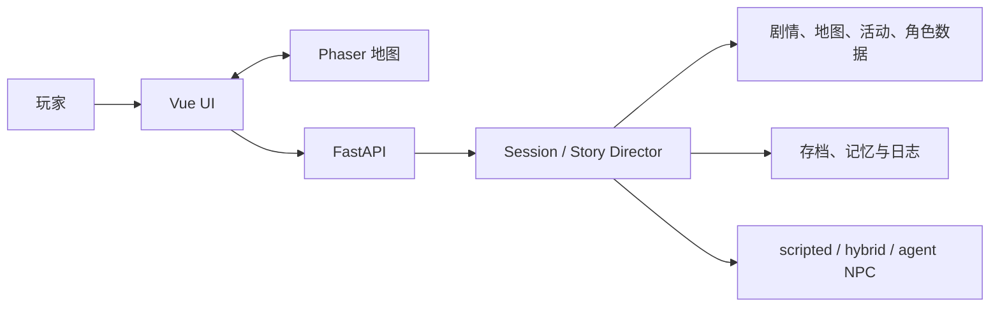

# UW 项目总纲

- **统一版本**：`0.6.0`
- **产品状态**：内部纵向切片，可开发、可试玩；玩法优化方向已确定，待分阶段实施
- **叙事范围**：卢利特村日常至爱丽丝被带走
- **玩家身份**：桐人
- **最后整理**：2026-08-08
- **详细设计**：玩法、世界观、剧情、角色和系统的完整设计见 `docs/GAMEPLAY_DESIGN.md`

## 1. 项目定义

UW 是一个单人 2D 叙事 RPG。玩家以桐人的视角，在卢利特村与尤吉欧、爱丽丝共同生活、劳动、调查并做出选择。选择可以改变关系、记忆、准备方式、对话和告别反馈，但不改写"爱丽丝最终被带走"的固定终点。

**0.6.0 设计方向转变**：叙事骨架已扎实，但玩法层必须让玩家"想再多玩一天"。在序章框架内填充足够丰富的日常玩法（采集、烹饪、钓鱼、收集、任务），使 15-25 分钟的主线体验之外仍有可重复的乐趣。参考星露谷物语的日常劳动产出、摩尔庄园/奥比岛的生活感与收集感、夏日狂想曲的关系可见反馈。

## 2. 为什么要收束

此前项目同时维护三条互相冲突的方向：

1. 原创"见习记录员"长期路线。
2. 用 Day 和月度编号持续扩张的系统验证内容。
3. 以桐人、尤吉欧和爱丽丝为中心的序章主线。

当前裁决：

- 只保留桐人视角的卢利特村序章作为产品方向。
- 旧 Day/月度内容可作为代码兼容和历史参考，但不再代表产品完成度。
- 玩家界面不显示内部构建号、素材请求号、旧身份或开发阶段代号。
- 当前事实只由本文件、`GAMEPLAY_DESIGN.md`、`PLAN.md`、`ASSET_REVIEW.md` 和 `DELIVERY.md` 表达。
- 旧方案依靠 Git 历史追溯，不继续在工作树中堆叠归档副本。
- **0.6.0 新增**：旧 v001/v002 写作文档已融合至 `GAMEPLAY_DESIGN.md`，不再作为独立活跃参考。

## 3. 玩家承诺

玩家进入游戏后应当迅速理解：

- 我是谁：桐人，卢利特村的见习记录员（村民岗位）。
- 我在哪里：卢利特村。
- 我和谁在一起：尤吉欧、爱丽丝、赛尔卡。
- 我现在要做什么：前往巨神树并与两人会合。
- 我每天还能做什么：砍树、读书、采药、钓鱼、巡查、帮村民做事。
- 我的选择有什么意义：影响关系、记忆、准备和后续回应。
- 我的劳动有什么意义：产出材料、提升熟练度、解锁新活动。
- 故事会走向哪里：越界、返村、宣罪、告别，最终爱丽丝被带走。

新玩家应在 60 秒内完成第一次有效互动，不需要阅读开发说明或理解内部系统名。

## 4. 剧情结构

主线使用十个连续节点，分为四幕：

| 幕 | 节点 | 核心内容 | 玩家作用 |
|---|---|---|---|
| 日常 | N01-N03 | 村庄会合、巨神树天职、三人关系 | 熟悉移动、互动、人物和规则 |
| 越界前兆 | N04-N05 | 前往尽头山脉、接触异常与受伤者 | 观察、准备并表达风险态度 |
| 触犯禁忌 | N06-N07 | 爱丽丝施救越界、三人返村 | 承担选择后果并形成记忆回响 |
| 宣罪与告别 | N08-N10 | 整合骑士到村、公开宣罪、告别、带走 | 见证固定终点，获得与此前选择一致的反馈 |

叙事规则：

- 终点固定，过程可变。
- 至少三次早期选择要在后续节点产生可见回响。
- 不提前写爱丽丝被带走后的学院、大教堂或战争剧情。
- 不让模型创建关键事实、奖励、资源结算或永久存档结果。
- 原作事实、项目补充和待确认内容必须在写作素材中区分。
- 完整剧情节点详表、跨节点回响和玩家介入模型见 `GAMEPLAY_DESIGN.md` 第四部分。

## 5. 核心玩法循环

### 5.1 主线循环（保持不变）

```text
看见一个明确主目标
-> 在地图上靠近人物或地点
-> 查看一次必要说明
-> 对话、选择或完成短交互
-> 后端原子结算时间、资源、关系和记忆
-> 立即看到结果
-> 在后续节点收到回响
```

### 5.2 日常活动循环（0.6.0 新增）

```text
每个时段选择一项活动（砍树/读书/采药/钓鱼/巡查/帮村民）
-> 进入对应小游戏或交互
-> 消耗时间+体力，产出材料/线索/关系点
-> 活动结束后看到产出和变化
-> 产出可用于制作/使用/赠送/解锁
-> 熟练度累积，解锁新活动或新选项
```

### 5.3 关系反馈循环（0.6.0 新增）

```text
做出选择
-> 关系数值变化（亲密度/信任/紧张）
-> UI 立即展示变化动画和数值
-> 达到关系阈值时解锁新对话/事件/选项
-> 关系状态影响后续节点台词和反馈
```

每次循环应满足：

- 同屏只有一个最强主目标。
- 附近互动入口明确，不与菜单或教学争夺注意力。
- 行动前说明代价和限制，行动后说明结果和原因。
- 失败或拒绝不会留下部分状态。
- 离线 scripted 模式可以从头到尾完成主线。
- **0.6.0 新增**：每次选择后必须有可见的关系变化反馈。

## 6. 当前范围

### 必须完成（P0）

- N01-N10 连续主线与唯一终点。
- 桐人、尤吉欧、爱丽丝三人的关系与记忆回响。
- 卢利特村、巨神树、尽头山脉和村中抓捕所需的最小场景表达。
- 移动、附近互动、对话、选择、结果、菜单、存档和恢复。
- 桌面键鼠与移动触控均可通关。
- 后端权威状态、原子行动、存档兼容、日志和回放。
- 素材来源、审核、runtime 映射和 hash 可追溯。
- 自动化回归和三名陌生玩家盲测。
- **关系系统可视化（0.6.0 新增 P0）**。
- **至少 3 种可重复生活活动有独立操作手感（0.6.0 新增 P0）**。

### 应在发布前完成（P1）

- **物品栏与消耗品系统**。
- **小游戏深度提升（连击/道具组合/多段判定）**。
- **记忆图鉴/成就面板**。
- **至少 2 个地图区域增加可交互内容**。
- Phaser chunk 分包。
- 焦点态、非颜色提示、字体和触控目标复查。
- 存档 schema 长期迁移说明。

### 当前不做（P2/P3）

- 爱丽丝被带走后的章节。
- 完整战斗系统、全角色动作包、全配音、3D、联网多人。
- 角色成长系统（等级/技能树）--P2 评估。
- 经济系统（货币/商店）--P2 评估。
- New Game+ / 多周目继承 --P3。
- Cocos 客户端迁移。
- 无边界 Agent Loop 或模型直接写入世界状态。
- 在授权评估前进行公开或商业发行。

> 玩法系统的详细设计（物品栏、熟练度、烹饪、采集、钓鱼、任务、记忆图鉴、关系可视化）见 `GAMEPLAY_DESIGN.md` 第七部分。

## 7. UI 与交互设计

界面只保留四个层级：

1. **世界层**：地图、角色、地点和移动反馈。
2. **目标层**：一个主目标与必要的方向提示。
3. **互动层**：附近人物/地点、对话、选择和结果。
4. **系统层**：菜单中的存档、读档、设置和开发辅助。

设计原则：

- 地图是主画面，不是面板的背景。
- 教学按需出现，不常驻重复。
- 按钮只承载行动；状态、原因和结果各有固定位置。
- 深色半透明底、暖金主线、青色信息；减少发光、边框和胶囊标签。
- 关键文字不用颜色作为唯一信息载体。
- 桌面 1440x900 与移动 390x844 不得遮挡主目标和主要按钮。
- 玩家可见文本统一使用桐人、尤吉欧、爱丽丝、卢利特村、巨神树、禁忌目录和神圣术。
- **0.6.0 新增**：每次选择后必须有可见的关系变化反馈。

> 0.6.0 新增 UI 元素清单见 `GAMEPLAY_DESIGN.md` 第九部分。

## 8. 美术与素材方向

### 视觉基线

- 村庄：雨后、清晨、暖色木石结构，有生活感，不做末日废墟。
- 边界：以局部冷色、风声变化和静默表达异常，不让全画面长期高压。
- 地图：正交或轻俯视，比例稳定，路径与地标清楚，无可见网格。
- 角色：统一轮廓、身高、像素密度、光照、脚底锚点和动作节奏。
- 关键图：服务剧情事实和人物关系，不用抽象魔法场景替代事件本身。

### 素材流程

```text
materials/inbox
-> 人工与技术审查
-> materials/review
-> materials/approved
-> frontend/public/assets/runtime
```

文件存在不等于可用。进入 runtime 前必须具备来源/权利说明、技术检查、内容检查、桌面与移动截图、清单映射和 hash。详细结论见 `docs/art/ASSET_REVIEW.md`。

> 0.6.0 新增素材需求见 `GAMEPLAY_DESIGN.md` 第十一部分。

## 9. 技术架构



所有权原则：

- FastAPI 提交位置、时间、资源、关系、flag、剧情闸和永久记忆。
- Vue 负责界面、流程调度和结果呈现。
- Phaser 负责地图、移动、碰撞、镜头和空间互动。
- 普通内容优先通过 JSON/schema 扩展；只有新交互形态才新增组件。
- 模型只能在白名单中提出候选，不得提交权威效果。
- scripted 是完整基线，外部 Provider 失败不得阻塞主线。

> 0.6.0 数据扩展方向见 `GAMEPLAY_DESIGN.md` 第十部分。详细模块和合同见 `docs/architecture/`。

## 10. 版本与发布定义

仓库、前端和后端统一使用 `0.6.0`。文档不再制造 preview、dev、阶段号或日期版本副本。

`0.6.0` 只有同时满足以下条件才可标记为可发布：

- 主线从新游戏连续完成，终点不能越界推进。
- 工程质量门和发布门禁全部通过。
- 阻塞素材完成并通过真实界面验收。
- 三名未参与开发的玩家完成盲测，主要阻塞已修复。
- IP 与素材权利得到明确处理。
- **0.6.0 新增**：关系系统可视化和至少 3 种可重复生活活动已实现。

在此之前，`0.6.0` 的状态是"内部纵向切片"，不是公开发行版。

## 11. 成功标准

### 原始标准（保持）

- 3/3 盲测玩家知道自己是桐人并理解当前目标。
- 3/3 能在无口头指导下完成第一次有效互动。
- 至少 2/3 能连续抵达 N10。
- 至少 2/3 能说出一次自己的选择如何影响后续反馈。
- 桌面和移动端无阻塞性 UI 重叠。
- 离线 scripted 模式完整可玩。
- 素材、状态和发布结论都有可检查证据，而不是仅凭"文件已生成"。

### 0.6.0 新增标准

- 3/3 玩家在通关后能说出至少 2 种自己做过的日常活动。
- 至少 2/3 玩家注意到关系数值变化并理解其含义。
- 至少 1/3 玩家主动尝试了主线之外的探索（采集/公告柱/石碑碎片）。
- 至少 1/3 玩家表示"想再玩一次看看不同选择"。
- 通关后记忆图鉴可正确展示所有选择路径。

## 12. 权利边界

当前原型包含《刀剑神域 Alicization》的既有角色、名称和设定。内部研发不等于拥有公开发行权。公开展示、分发或商业化前，必须完成授权评估；若无法获得适当权利，应将世界、角色、术语、剧情锚点和视觉识别整体原创化，而不是只替换少量名称。

## 13. 文档入口

1. **[统一项目指南](MASTER_GUIDE.md)**：**项目唯一入口，包含一切。永远先读这一份。**
2. **[玩法与内容设计总纲](GAMEPLAY_DESIGN.md)**：世界观、地点、剧情、角色、玩法系统、小游戏、UI 的完整设计。融合了所有旧 v001/v002 写作文档。
3. [统一计划](PLAN.md)：真实完成度、当前工作、优先级、验收和冻结项。
3. [素材审查](art/ASSET_REVIEW.md)：可用素材、返工项和下一批素材规格。
4. [交付规则](DELIVERY.md)：开发、测试、盲测、发布和版本规则。
5. [生图智能体 Prompt](art/GENERATION_AGENT_PROMPT.md)：新的生图智能体必须遵守的完整生成、验收和交付规范。
6. [当前素材任务单](art/ASSET_TASKS.md)：按 T01-T04 顺序执行的下一批任务。
7. [架构总览](architecture/SYSTEM_OVERVIEW.md)：系统所有权和模块关系。
8. [运行手册](operations/RUNBOOK.md)：环境、启动和常见验证命令。

旧方案、旧版本说明和过期阶段文档已从工作树删除；需要追溯时使用 Git 历史，不再让历史文件与当前方案并列。
