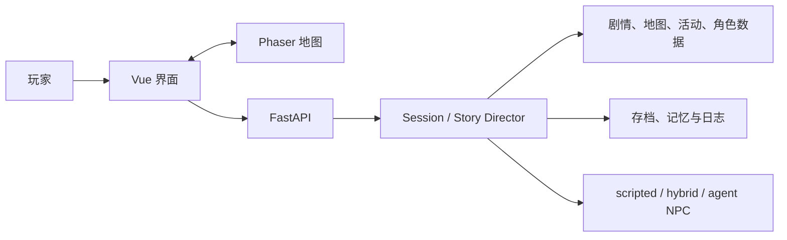

# UW 项目总览

- **状态**：内部收束版
- **审核日期**：2026-08-07
- **当前目标**：完成爱丽丝被带走之前的单人 2D 叙事 RPG 纵切片

## 一句话定义

玩家以桐人的视角，在卢利特村与尤吉欧、爱丽丝共同生活和行动；日常选择会改变关系、记忆、准备和告别方式，但不会改写爱丽丝最终被带走的正典终点。

## 根源审核

项目之前混合了三套目标：原创见习记录员长线、按 Day 扩张的系统验证内容、Alicization Pre-Capture 主线。三套内容共用 UI、状态提示和素材请求，造成以下根源问题：

1. **身份冲突**：文档写桐人，游戏首屏和 HUD 却仍显示“见习记录员”。
2. **范围失控**：旧 Day 长线、月度路线和新十节点主线并存，测试量上升但玩家体验没有同步收束。
3. **界面堆叠**：标题、运行模式、HUD、循环教学、任务、附近互动、小地图和快捷栏同时常驻，地图反而成为背景。
4. **素材版本爆炸**：同一资产保留多轮 `v00x`、工作文件、缩略图、原始图和重复音频，文件存在被误当作“已完成”。
5. **质量门混用**：开发质量、发布素材和真人盲测被放在一个脚本里，导致日常代码检查也被尚未完成的发布条件阻塞。
6. **交接文档复制**：多份带日期的 handoff、status、upgrade 文档重复陈述同一事实，后来的文本很快失真。

本轮收束不重写后端核心，而是先统一身份、入口、文档、UI 层级、素材状态和质量流程。

## 产品边界

### 必须保留

- 卢利特村三人日常与巨神树天职。
- 尽头山脉洞窟、受伤者、爱丽丝施救越界。
- 返村、公开宣罪、告别与抓捕终点。
- 至少三次跨节点可见的关系或记忆回响。
- 完全离线可玩的 scripted NPC 基线。
- 后端权威状态、原子行动、存档兼容与可回放终点。

### 暂不扩展

- 爱丽丝被带走后的学院、中央大教堂和战争剧情。
- 旧 Day 长线与月度路线的新内容。
- 完整战斗、全角色动作包、配音、3D 或客户端迁移。
- 由大模型直接修改剧情事实、资源或永久存档。

## 核心体验

```text
看见明确目标
→ 在地图上靠近人物或地点
→ 了解代价、收益和风险
→ 做出一次选择或完成短交互
→ 后端结算时间、资源、关系和记忆
→ 立刻看见结果，并在后续节点收到回响
```

玩家在任意时刻只应看到一个主目标、一个附近互动入口和一组必要快捷操作。教学信息按需出现，不常驻占据地图。

## 设计方向

- **世界**：雨后暖色村庄为基线，边界异常只使用局部冷色与静默，不把全屏做成灾难色。
- **地图**：正交或轻俯视、稳定比例、路径清楚、无可见网格；背景图不能替代碰撞、遮挡和交互数据。
- **角色**：三位核心角色必须在轮廓、身高、光照、像素密度和动作节奏上属于同一套系统。
- **UI**：深色半透明底、暖金主线、青色信息；减少边框、发光、胶囊标签和重复说明。
- **文字**：玩家可见名称使用自然语言；内部 ID、构建号和历史版本号不出现在首屏和任务标题。
- **反馈**：按钮只承载行动；状态、原因和结果各有一个明确位置。

## 技术框架



- 后端提交事实，前端只预测和展示。
- 普通内容优先数据化；只有新交互形态才新增组件。
- 素材从 inbox 到 review、approved、runtime 逐级推进。
- `quality.sh` 检查代码和仓库健康；`release.sh` 再检查素材、真人盲测和 E2E。

## GitHub 工作方式

- `main` 只接收可回滚、已验证的提交。
- 每个分支只解决一个可描述的问题；本轮分支为 `codex/clean-release`。
- 提交按“文档/素材清理”“UI 收束”“质量门”拆分，避免一个巨大不可审查提交。
- 二进制素材不得用“覆盖旧文件”表达版本；文件使用稳定名称，修订由 Git 提交和清单 hash 追溯。
- PR 必须写明玩家变化、素材变化、测试、风险和回滚方式。

## 收束计划

1. **入口统一**：首屏、HUD、任务和文档统一为桐人视角的 Pre-Capture 主线。
2. **界面减法**：合并系统操作，移除重复常驻教学，让地图、主目标和附近互动成为三层核心。
3. **素材分级**：可用素材保留；技术合格但美术不合格的标为 prototype；不完整或缺来源的移出 active inbox。
4. **主线验证**：从新游戏连续完成全部关键节点，验证终点不可继续推进。
5. **发布验证**：补齐 P0 素材，完成桌面/移动验收和三名陌生玩家盲测。

## 发布判定

只有同时满足以下条件才可称为可发布候选：

- 主线从新游戏连续完成，终点稳定且可回放。
- 没有 P0 素材缺口，所有 runtime 文件可追溯。
- 后端、前端单测、build、E2E 与 diff 检查通过。
- 桌面和窄屏关键流程无阻塞。
- 三名未参与开发的玩家完成盲测并留下记录。
- 对既有作品名称、角色和设定的公开使用方式已完成权利评估。
