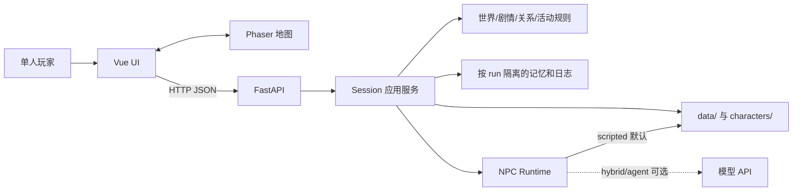
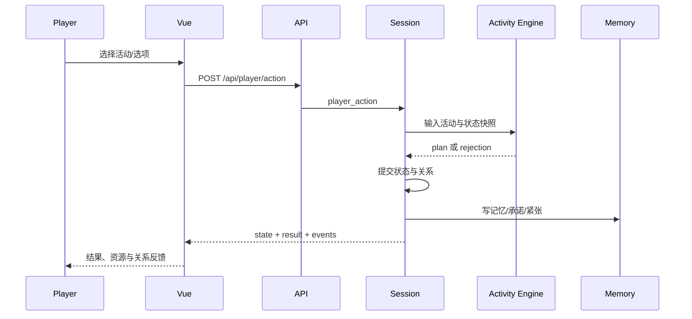

# 系统架构总览

- **状态**：Current
- **架构**：模块化单体 + 数据驱动内容
- **最后更新**：2026-08-04

## 系统上下文



## 原则

1. **后端权威**：位置、时间、资源、关系、flag、剧情闸和奖励以后端为准。
2. **前端表现**：Vue/Phaser 可预测和展示，不能自行提交永久事实。
3. **内容/代码分离**：普通事件、活动、日程、对话优先配置化。
4. **AI 可插拔**：模型不可用时 scripted 主线完整。
5. **行动原子化**：校验失败不写资源、flag、关系、记忆。
6. **渐进拆分**：提取纯函数和注册表，不做大爆炸重写。

## 目录职责

```text
backend/app/
  main.py               HTTP 入口、run/session 选择
  session.py            事务编排、权威状态提交、日志/记忆提交
  activity_engine.py    活动纯规划与校验（无 IO）
  world.py              时间、环境、日程和基础行动
  story_*.py            剧情目录、事件与节点闸
  relationship.py       关系规则与档案投影
  npc_runtime.py        scripted/hybrid/agent 路由与回退
  memory_store.py       运行记忆持久化
frontend/src/
  App.vue                应用壳与 API 状态
  components/            UI 与小游戏
  field/                 Phaser、地图绘制、活动注册表（panel / 提示 / 结果字段）
  composables/           API、音频、toast、叙事进度
data/                    世界、剧情、地图、活动、日程
characters/              persona、背景、固定对话、元数据
runs/                    本地日志（非配置）
```

## 场景活动数据流



`Activity Engine` 必须是纯函数：不写文件、不调用模型、不修改 Session；Session 在完整校验通过后提交。

前端特殊活动通过 `field/activityRegistry.js` 声明 panel、打开/完成提示和小游戏结果字段；`FieldSlice.vue` 只负责调用统一完成流程。interaction kind 可以复用既有展示适配，但未知活动不得猜测结果字段。

## 扩展规则

- 新普通活动：先改 `scene_activities.json`；只有新交互形态才改前端注册表/面板。
- 新 NPC：新增角色目录、元数据和模式；UI 不重复硬编码名字。
- 新永久字段：更新 model、存档兼容测试和契约；所有权变化写 ADR。
- 新模型能力：通过 runtime 接入，必须有超时、回退和审计。

`createWorldFieldScene.js`、`npc_intents.py` 等仍是热点；拆分前先补角色测试和独立 ADR，避免为了文件变小改变玩法。

## 日期推进数据流（2026-08-05）

```text
玩家完成当日活动
→ 后端写入活动结果/关系/记忆
→ Story Director 检查 required_story_event 与 day_end_gate
→ 条件满足：生成日结算
→ 自动执行 NPC 日程与环境切换
→ 进入下一日并返回 next_goal
→ 前端展示日结算和新目标
```

日期推进的所有权归 `Session + Story Director`。前端不得直接调用“推荐日期”或自行修改 `day`。自动 tick 可以推进时间段、NPC 行为和环境，但跨日必须有可审计的剧情原因。
