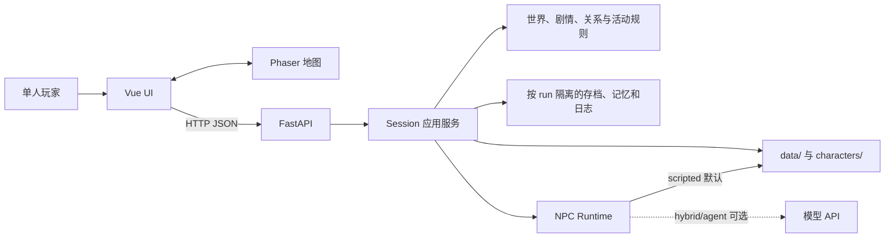
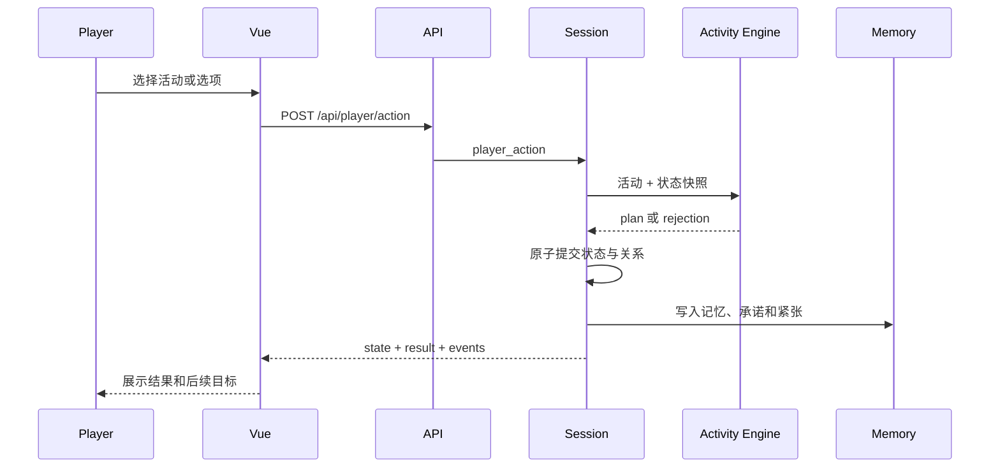

# 系统架构总览

- **架构**：模块化单体 + 数据驱动内容
- **当前客户端**：Vue + Phaser
- **状态权威**：FastAPI

## 系统上下文



## 核心原则

1. 后端决定位置、时间、资源、关系、flag、剧情闸和奖励。
2. Vue/Phaser 负责输入、表现和预测，不自行提交永久事实。
3. 普通事件、活动、日程和对话优先数据化。
4. scripted 模式必须完整可玩；模型能力只做可回退增强。
5. 行动先完整校验再原子提交，失败不留下部分状态。
6. 渐进提取纯函数和注册表，不做无证据的大爆炸重写。

## 目录职责

```text
backend/app/
  main.py               HTTP 入口与 run/session 选择
  session.py            权威状态提交、存档、日志和记忆编排
  activity_engine.py    活动规划与校验纯函数
  world.py              时间、环境、日程和基础行动
  story_*.py            剧情目录、事件、节点和闸门
  relationship.py       关系规则与档案投影
  npc_runtime.py        scripted/hybrid/agent 路由与回退
  memory_store.py       按 run 持久化记忆
frontend/src/
  App.vue                应用壳与 API 状态
  components/            UI、对话、事件、结果和菜单
  field/                 Phaser 地图、移动、活动注册与视觉配置
  composables/           API、音频、提示和叙事进度
data/                    世界、剧情、地图、活动和日程
characters/              persona、背景、overlay、固定对话和元数据
materials/               候选素材、审查、批准和台账
runs/                    本地运行日志，不是配置源
```

## 行动数据流



`Activity Engine` 不写文件、不调用模型、不修改 Session。只有 Session 能在完整校验通过后提交结果。

## 剧情推进

```text
玩家完成当前互动
→ 后端写入结果、关系和记忆
→ Story Director 检查当前节点条件
→ 条件满足时生成结算与下一目标
→ NPC 日程和环境根据权威状态更新
→ 前端展示结果和新目标
```

跨节点推进的所有权属于 `Session + Story Director`。前端不得直接修改 day、story_node 或永久 flag。

## 扩展规则

- 新普通活动：优先修改数据文件；只有新交互形态才增加前端面板。
- 新 NPC：增加角色目录、元数据和模式，不在多个 UI 位置重复硬编码名称。
- 新永久字段：更新 model、存档兼容测试和客户端契约。
- 新模型能力：通过 runtime 接入，必须有白名单、超时、预算、审计和 scripted 回退。
- 所有权或不可逆边界变化：写 ADR。
